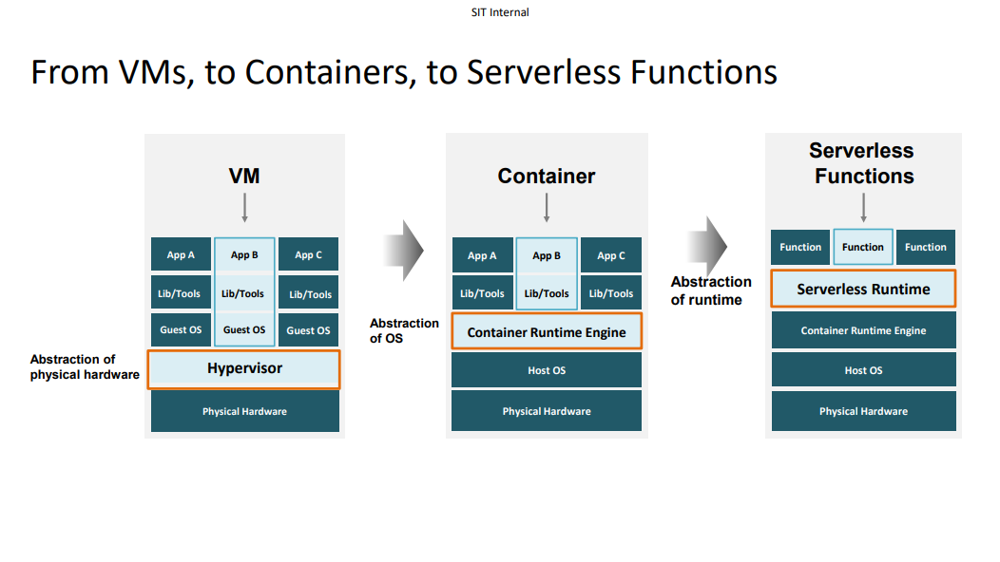

# Cloud-Notes
# Chapter 1
## Cloud Computing Basics
### What is cloud computing
* Cloud computing is a style of computing in which scalable and elastic IT-enabled capabilities are delivered as a service using internet technologies
### Why is it called Cloud
* Cloud is a group of networked elements providing services
### Pay as you Go (Pay per use)
* A form of cloud payment model that allows users to be charged according to the usage of cloud resources
### Benefits of Cloud Computing
* Benefits of cloud computing include flexibility, elasticity, cost efficiency, unlimited data storage for big data, backup and recovery, easy deployment

## Cloud Virtualization
### Virtualization and Cloud Services
* Computer Resources / Infrastructure -> Virtualization ->Cloud Applications & Services

### Computer Virtualization
* Virtualization uses software to create an abstraction layer over computer hardware to divide a single computer - processors, memory, storage, network into m,ultiple smaller virtual units
* Virutalization hides the physical characteristics of computing resources from their users, supporting different applications/ services on top of them.
### Terminologies
* Virtualization: The technology which enables an abstraction level of resources, including virtual computers, storage device, computer network resources
* Hypervisor: A software that creates and runs virtual machines(VMs).
*  Virtual Machine: A software emulation of a physical computer
### Benefits of Virtualization
* Encapsulation and Isolation
* Cost Reduction
* Hardware Utilization
* Energy Saving
* Flexibility
* No hardware/ software lock-in
* Replication for recovery
* Quick Server Provisioning
### Type 1 Hypervisor
Pros:
* Highly Efficient
* Good security

Cons:
* Separate management Machine

### Type 2 Hypervisor
Pros:
* Quick and Easy to access

Cons:
* Latency Issues
* Security risk

### VMs to Containers
* Hypervisors allow multiple VMs on a single machine
* Multiple containers can run on the same machine and share the OS with other containers

### Benefits of Containers
* Lightweight with much less overhead
* Able to launch applications much more quickly

### Container Software Structure
* Containers run on the same Host OS
* Each container has its own application and can run independently

### Key Takeaways
* Virtualization hides the physical characteristics of computing resources from their users, supporting different application / services on top of them
* Virtual Machines(VMs) are created based on server virtualization technology which divides a physical server into multiple unique and isolated virtual servers
* Containers are created based on operating system virutalization which enables application to run in their own isolated partitions on top of a shared OS. Compared to common VMs, containers are lightweight and fast to boot up.

## Evolving Cloud Services
### Different Types of Cloud Services and Business Models
* Software-as-a-Service (SaaS)
* Platform-as-a-Service(PaaS)
* Infrastructure-as-a-Service(IaaS)

### Virtual Machines vs Containers vs Serverless Functions

### Key Takeaways
* Virtualization technology has evolced from virtualizing basic computing resources to virtualizing other resources at different abstract levels which leads to various type of cloud services
* Various forms of clouds like public, private, hybrid and multi-clouds to cope with users' demand-on the diversity, security and efficiency of services
* Microservices are an architectural and organizational approach where software is composed of small independent services enabling fast development and innovation

## Summary
### Key Takeaways
* Cloud computing enables online computing services which provide IT-related capabilities such as computers, storage and applications with pay-as-you-go payment models
* Virtualization enables sharing of a physical IT resource with multiple users via different cloud service models
* Hypervisor is a form of server virtualization which allows one host computer to support multiple guest VMs by virtually sharing its resources, such as memory and processing
* Container Runtime Engine is a form of OS virtualization which incapsulates multiple applications and services to run on top of a shared OS
* New cloud computing technologies such as microservices, serverless computing, etc enable app modernization and deploy and run cloud services in dynamic cloud environments