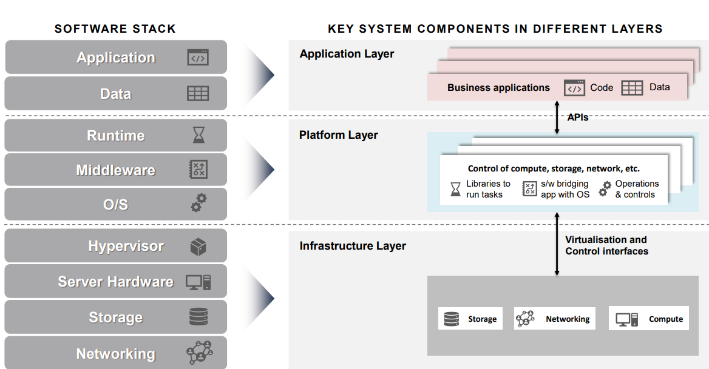
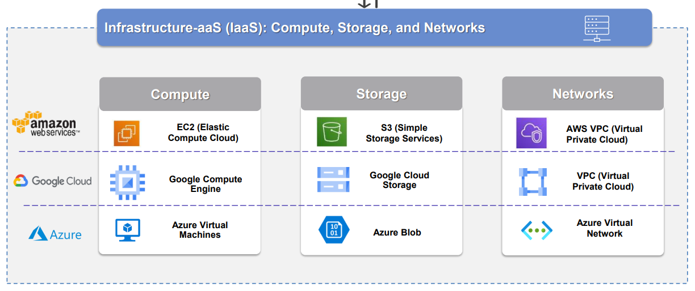
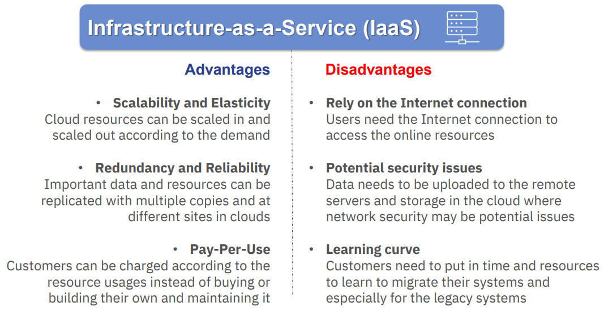
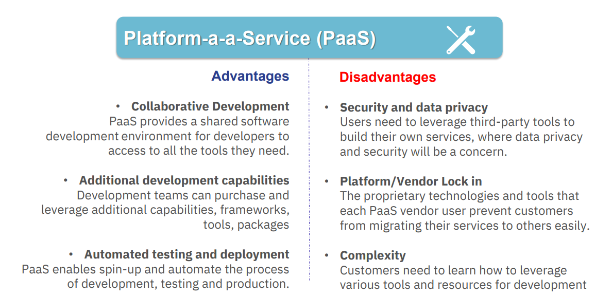
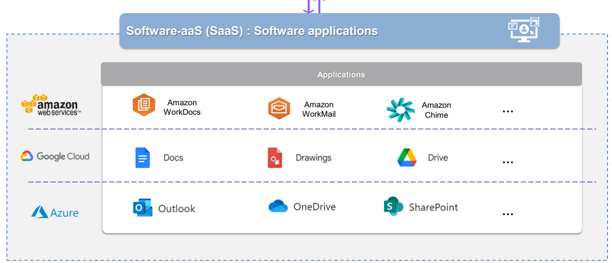
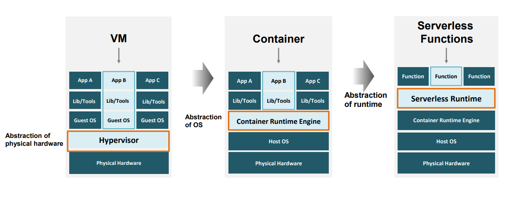
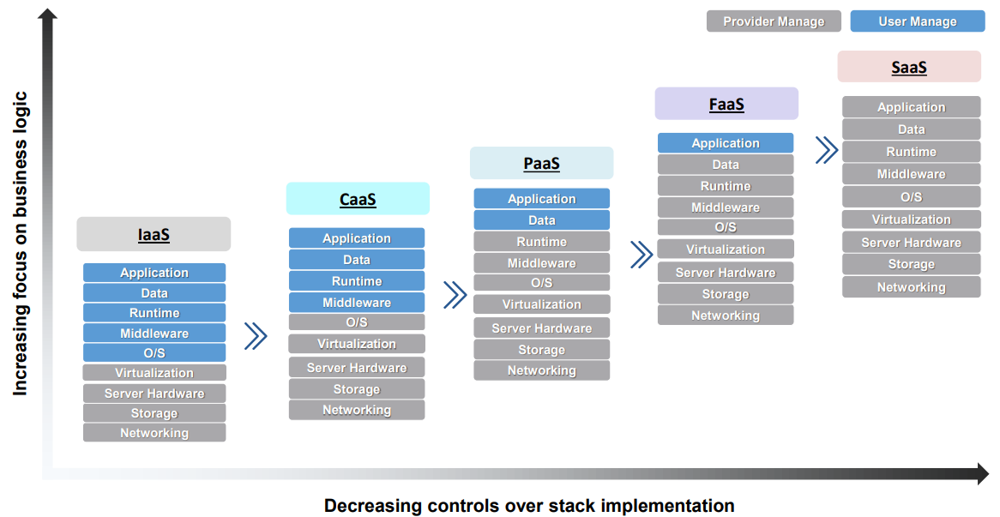

# Cloud Service Models
## Cloud Software Stack
### Software Stack for Cloud Services

# Infrastructure as a Service
* IaaS provides on-demand services of computing infrastructure such as **servers, storage, and networking resources** that users can configure and use via Internet
## Examples of IaaS

## Launch a Cloud Instance
* A cloud compute instance aka cloud instance is basically a virutalized computer server that includes CPU, RAM and storage, and is offered by a cloud computing platform
## Cloud Service Pricing
* Price according to usage
* $ per minute/second
* Cost Estimation: Tools to help calculate the cost
* Monitoring the bull
## Services with no Charge
* Others to note
    * Services with no charge
        * Within 12 months
        * Always
        * Trial
## Pros and Cons of IaaS Comparing with Traditional IT(On Premise)

## Typical Use Cases
* Dynamic or unpredictable demands
* Limited captial investment and fast innovation
* Large volume of daata and online access
* Disaster recovery
# Platform as a Service
* PaaS offers various development tool such as database, **middleware, runtime frameworks, O/S**, etc. to developers for application development, maintenance, and updates
## Examples of PaaS

## Pros and Cons of PaaS Compared with Traditional IT(On Premise)

| Pros | Cons |
| ----------- | ----------- |
|Collaborative Development | Security and data privacy |
| Additional development capabilities | Platform/ Vendor Lock in |
| Automated testing and deployment | Complexity |
## Tpyical Use Cases
* Api development and management
* Real time data processing
* Agile development and DevOps
* Cloud native development and hybrid cloud strategy
# Software as a Service
* Software as a service provides on-demand software services by hosting **applications** and making them available to end users over the Internet
## Examples of SaaS

## Pros and Cons of SaaS compared with Traditional IT(On Premise)
| Pros | Cons |
| ----------- | ----------- |
| On-demand, variable workload, one-to-many | Security and data privacy |
| Compatible to various devices | Internet connection is required |
| Easy IT maintenance | Limited customization options |
## Typical Use Cases
* Business Services
* Social networks
* Document management
* Mail services
# Key Takeaways
* IaaS provides on-demand services of computing infrastructure such as servers, storage and networking resources that users can configure and use via the interenet
* PaaS provides a cloud based platform which manages various developement tools such as databases, middleware, runtime frameworks, development tools as well as related services for security, OS and software upgrades, backups and more for application development
* SaaS provides on-demand software services by hosting applications and making them available to end users over the internet
# New Cloud Service Models
## New Services
* Containers as a Service (CaaS)
* Serverless Function - Functions as a Service (FaaS)
* Everything as a Service (XaaS)
## The abstraction form Vms to Containers to Serverless Functions

## Relationship between Business Logic and Control of Stack Implementation

## Examples of CaaS and FaaS
|       | CaaS | FaaS |
|-------|------|------|
| aws   | ECR/ ECS/ EKS |Lambda Function|
| google cloud|GKE|Google Cloud Functions|
| azure | AKZ|Azure Function|
## Key Takeaways
* 3 distinct cloud service models namely **IaaS, PaaS and SaaS**
* Users and vendors share the responsibility of managing different layers of the software components for different cloud service models to meet the requirements of different end-users and their needs
* New cloud service models CaaS and FaaS. The shift to higher level of abstraction of cloud services leaving the IT resources managed by the providers
# TLDR
## Key Takeaways
* **3 Models IaaS, PaaS, SaaS**
* **2 Upcoming ones CaaS and FaaS**
* **Important to know the pros and cons of the different models**