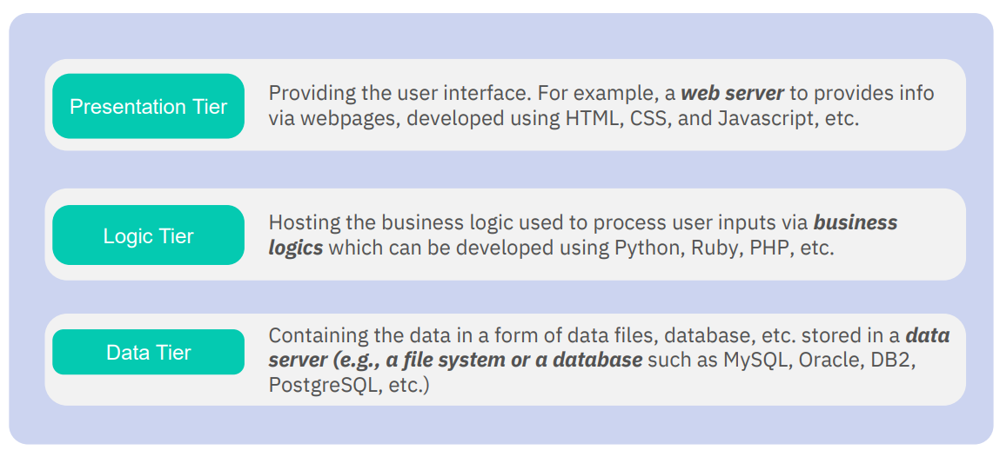
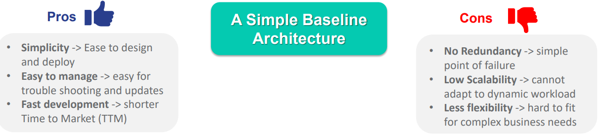
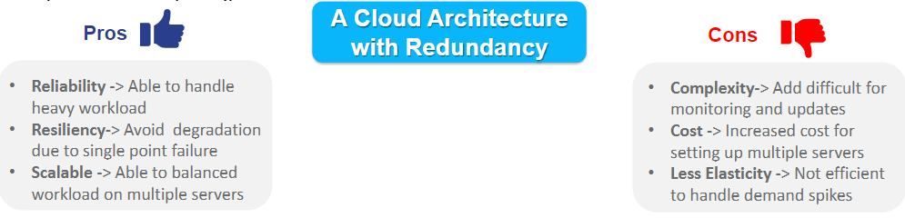
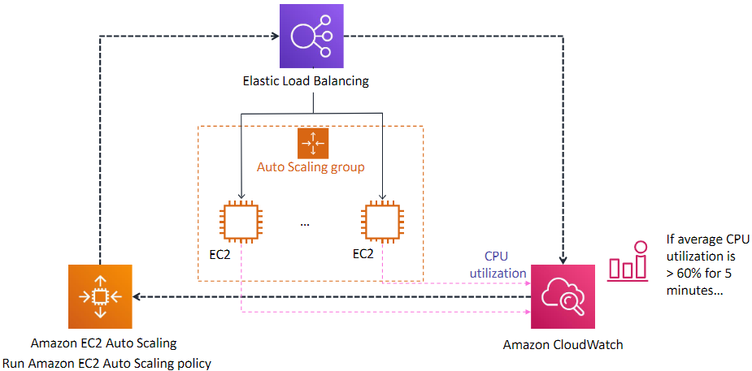
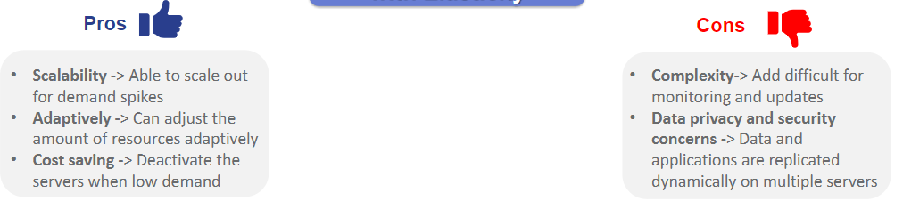
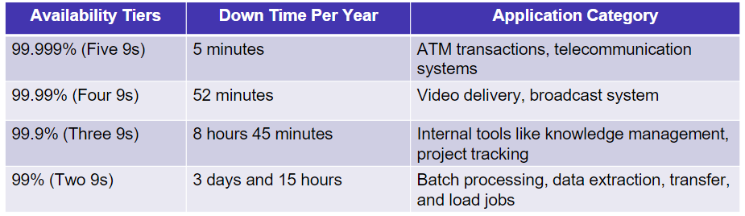

# Chapter 3 Cloud Deployment
# Cloud Deployment Models
## Cloud Deployment Models
* Public Cloud
* Private Cloud
* Hybrid Cloud
* Multi Cloud
## Public Cloud
* Open to access
* Provisioned for open use by the general public
### Examples of Public Cloud Services Providers
* AWS
* Azure
* Google Cloud
* IBM Cloud
* Salesforce
* Alibaba Cloud
* Huawei
### Pros and Cons of a Public Cloud vs Traditional IT
| Pros | Cons |
|--- | --- |
| Availability and Accessibility | Data Privacy and security issues|
| Scalability | Integration and Migration |
| Pay-per-use | May be costly|
## Private Cloud
* Private access by users within an organization
* Provisioned for exclusive use by a single organization
### Examples of Private Clouds
* Internal Private Cloud (by organization)
* Hosted Private Cloud (3rd party)
### Pros and Cons of a Private Cloud vs Traditional IT
| Pros | Cons |
|--- | --- |
| Security and Data Privacy | Cost and Maintenance|
| Performance | Lack of Scalability |
| Support and Troubleshooting | Remote Access |
## Hybrid Cloud
* Private and Public Cloud
* Composed of 2 or more distinct cloud infrastructure (private or public)
* At least one private and public cloud
### Examples of Hybrid Clouds Solution Providers
* Cisco Hyperflex Solutions
* Greenlake
* Federal Community Cloud (FCC)
* Microsoft Government Community Cloud(GCC)
* Rackspace Technology
* vmware
* CITRIX
### Pros and Cons of a Hybrid Cloud vs Traditional IT
| Pros | Cons |
|--- | --- |
| Improved Security and Data Privacy |Added Complexity|
| Cost Optimization |Expertise|
|Support legacy applications||
## Multi-Cloud
* More than 1 cloud service provider
* Can come from different vendors or cloud service providers
### Examples of Multi-Cloud tools

### Pros an Cons of a Multi-Cloud vs Public Cloud
| Pros | Cons |
|--- | --- |
|Prevent Vendor Lock-in|Security Concerns|
|Availability and Redundancy|Management Complexity|
|Leverage Various Capabilities|Expertise|
## Key Takeaways
* 4 Different Cloud Deployment Models
  * Public Cloud is open to general public
  * Private Cloud is limited to a particular organization
  * Hybrid Cloud comprises of at least 1 private and public cloud
  * Multi-cloud include 2 or more cloud infrastructures
* Each model has pros and cons
# Scalable Cloud Architecture
## Standalone to Scalable

## Single Baseline Architecture
* In a simple baseline architecture an application acan be delivered by a single cloud server (e.g. A VM)
## Example of 3-Tier Web Application
* Presentation Tier
  * Providing the UI.
* Logic Tier
  * Hosting the logic used to process user inputs via business logics 
* Data Tier
  * Contains the data in the form of data files, databases, etc stored in a data server

## Implementation Example
* Step 1: Set up the VM instance in a Public Cloud
* Step 2 Program the appplication in the VM instance
* Start the web service from the VM instance
## Use case of 3-Tier Application
* Personal Webpages
* Business Websites
* Simple Web Application
## Design Consideration

| Pros | Cons |
|--- | --- |
|Simplicity|No Redundancy|
|Easy to Manage|Low Scalability|
|Fast Development|Less Flexibility|
## Scalable Cloud Architectures
* Scale Up/Down
  * Vertical Scaling: Increase or decrease the capacity of existing services/ instances
* Scale In/Out
  * Horizontal Scaling: Add or reduce the amount of resources e.g., VMs to overall system
## Cloud architecture with Load Balancer
* Load Balancer helps delegate traffic across multiple servers and the application is configured to allow data access from multiple distribured storages
* Load Balancer also helps delegate traffic when there are individual server failures
## Examples of Scalable Cloud Architecture
* Online Data Repositories
* Business Services
## Pros and Cons of Cloud Architecture with Redundancy

## Challenges : Failure and Demand Fluctuations
* Redundancy
  * When a web server instance fails to connect to load balancer, the load balancer will direct the load to all the connected instances
* Limitations
  * The failures will **not be automatically replaced** by new ones 
  * When the demands **increases/decreases, no additional resources** will be added or removed from the system to cope with the challenges  
# Elasticity and Recovery
## AutoScalling
* A dynamic pool of cloud servers will work together to handle variable load. When an instance exceeeds a certain work load, the load balancer will add or remove cloud servers.
* When there is a failure the auto scaler will help initiate a new instance
## Examples of Cloud Architecture with Elasticity
* Social Media Networks
* Ecommerce
## Autoscalling in AWS

## Setup of AutoScale Policy
* Metric Type
  * Performance metric of auto scalling
* Target Value
  * Threshold for auto scalling
* Response time
  * Duration to allow instance warm up
## Pros and Cons of Cloud Architecture with Elasticity

## Avaliability Tiers
* Calculated by the percentage of time that the system is operating normally
* Commonly refered as **number of 9s**.
  
# Key Takeaways
* ### There are 4 types of cloud deployment models public, private, hybrid, multi-cloud each with different pros and cons
* ### 3 Types of Cloud Architectures
  * ### Simple Cloud Architecture
  * ### Scalable Cloud Architecure with a load balancer
  * ### Elastic Cloud Architecture with autoscalling capability