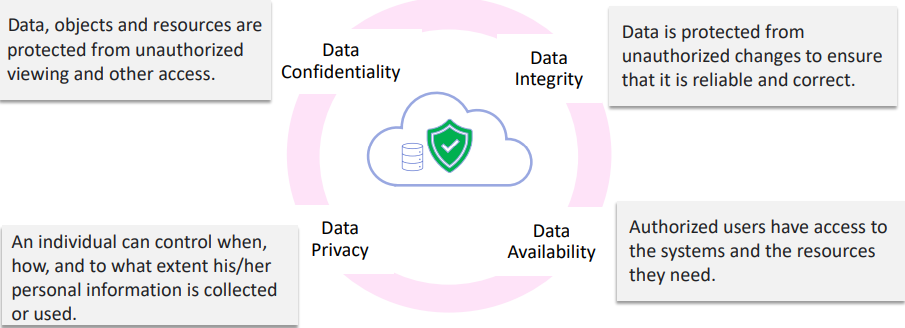
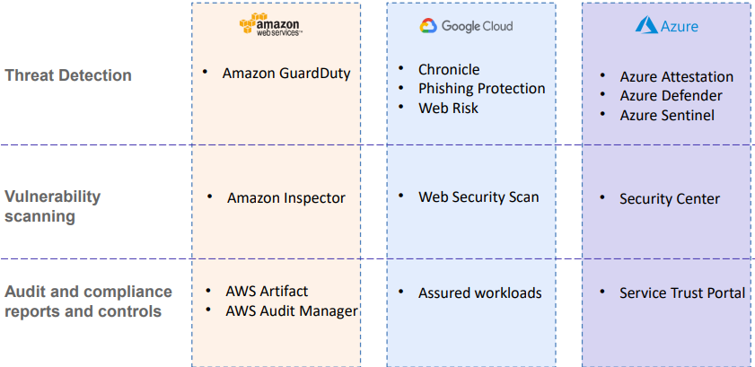

# Chapter 5 Cloud Security
# Cloud Security Concept
* ### Cloud security is designed to protect cloud-based infrastructure, application, and data using user and device authentication, data and resource access control, and data privacy protection
## Cloud Security Risks
### Notorious Nine

## Cloud Shared Respondsibility
* Security and compliance is a shared responsibility. The specific respondsibility vary on which model you are using SaaS, PaaS, or IaaS
## Cloud Security Standards and Compliance Resources

## CSA Cloud Computing Security Matrix (CCM)

## Key Takeaways
* ### Cloud security is a collection of measures to protect cloud-baseed infrastructurem applications and data
* ### A Cloud shared respondsibility model, security and compliance is a shared responsibility between Cloud Service Providers and Customers. The responsibilities depends on the service model
* ### Cloud security standards and control frameworks like Cloud Security Alliance (CSA) aim to help align data securityt policies and mitigate the risk of deploying third party cloud infrastructure. Cloud security compliance frameworks like CSA CCM, NIST Cybersecurity Framework, Multi-Tiered Cloud Security SS584 comply with regulatory cloud standards
# Access Control and Network Security
## Identity and Access Management (IAM)
* IAM is a fine grant control specifying who or what resources can access.
* Also manages identities across single or multiple AWS accounts and refine access perms using IAM policies
## Essential Components of IAM - IAM Identity
* ### IAM user 
  * A person or application who can log into a cloud platform using an account
* ### IAM Group
  * A collection of IAM users granted with identical authorization
* ### IAM Role
  * A method to give permission for service request
## Essential Components of IAM - IAM Policy
* IAM policy is a document that defines the permissions. Enables fine grant access to cloud resources/ services
* Identity-based policy
  * A policy define which identity can access what resources. Can be attached to one or multiple identities
* Resources-based policy
  * A policy defines which resource entity can access what resources. It is attached to the resource entity
## Identity-based policies example

## Multi Factor Authentication (MFA)
* MFS adds a layer of defense & reduce exposure to cyber risks
* MFS is suggested for root user
* Forms of MFA
  * Code verification
    * MFA token, QR code authentication, mobile OTP
  * Biometric verification
    * fingerprint scanning, facial verification and voice verification
## Best Practice for access controls

## Virtual Private Cloud (VPC)
* A VPC is designed to provide an isolated environment within a public cloud infrastructure
* Each VPC operates independently, ensuring that the resources and network traffic within one VPC are isolated from other VPCs, maintaining privacy and security
## Subnets
* A public subnet is accessible from the internet. Typically connected with an Inernet Gateway so that resources can be directly reachable by public
* A private subnet is part of a VPC that is not directly accessible from the internet. Can only be accessed through specific controlled gateways
## Classless Inter-Domain Routing (CIDR)
* Defines the range of IP addresses to use

  * Within 28 = 256 addresses, **5 IP addresses are reserved by the system**, so users can only use 256 - 5 = 251
### Range of IP Addresses for subnets

## Route Tables
* Routes are individual rules in a route table. Each route table specifies a destination and a target
### Route Tables: Local Connectivity

* Destination
  * Specifies the IP Adr range for the traffic dst
    * "10.0.0.0/16" is a CIDR block representing all IPs within the VPC
* Target
  * Indicates where the traffic should be directed
    * local refers to routing within the VPC itself
### Route Tables: Public Access with Internet Connectivity

* Destination
  * Specifies the IP Adr range for the traffic dst
    * "10.0.0.0/16" is a CIDR block representing all IPs within the VPC
    * "0.0.0.0/0" represents all IP adr (essentially the entire internet)
* Target
  * Indicates where the traffic should be directed
    * local refers to routing within the VPC itself
    * "igw-id" is an internet Getways, used for internet-bound traffic
### Route Tables: Secure Internet Access via NAT Gateways
* A network address translation(NAT) gateway allows instances in a private subnet to access w/o exposing them directly to the internet

* Destination
  * Specifies the IP Adr range for the traffic dst
    * "10.0.0.0/16" is a CIDR block representing all IPs within the VPC
    * "0.0.0.0/0" represents all IP adr (essentially the entire internet)
* Target
  * Indicates where the traffic should be directed
    * local refers to routing within the VPC itself
    * "nat-igw-id" is a NAT gateway, used for indirect internet access
## Key Takeways
* ### Identity and Access Management(IAM) is a fine grant control specifying who or what resources can access. It also maanges identites across single or multiple AWS accounts and refine access perms using IAM policies
* ### Virtual Private Cloud (VPC) and subnet are logically isolated sections containing a pool of resources from the public cloud. Users can set rules in Firewall/Security Groups and specify the route tables to control network access
* ### A route table is a table containing the routes that specify the destination which network traffic is routed. In cloud a destination is specified with CIDR block as a range of IP addresses in a subnet
# Data Security
## Data Confidentiality, Integrity, Availability, Privacy

## Techniques and Solutions for Data Security and Privacy

## Secure Data Store and Transfer -Data Encryption

## Secure Shell (SSH) Key for Secure Data Transfer

## Authorization and Authentication for Data Access

## Monitoring and Protection for Secured Data Services

## Personal Data Protection
* Personal Data
  * Any Information relating to an indetified or indetifiable individual
* Law and regulations
  * Singapore Personal Data Protection Act(PDPA), EU General Data Protection Regulation (GDPR), US California Consumer Privacy Act(CCPA)
* Cloud Personal Data Protection
  * Cloud services for personal/sensitive data discovery and protection
    * Amazaon : Macie
    * Google Cloud : Cloud Data Loss Prevention
    * Azure : Azure Information Protection
## Other security tools and services

## Key Takeaways
* ### Data integrity, confidentiality, availability and privacy are essential for data security
* ### Data encryption is a process converting plaintext data into ciphertext to protect data. One of the most effective ways to protect cloud data *in transit or at rest*
* ### A key pair consist of public(stored on cloud Vm) and private(stored in local machine) keys is a set of security credentials for a user to connect to cloud VM instance
* ### Regulations like PDPA, GDPR, CCPA provide a standard for personal data protection
# Key Takeaways
* ## In Cloud shared respondsibility model both user and cloud service providers are respondsible for security and compliance. Specific Responsibilities vary on the service model
* ## Identity and Access Management(IAM) is a fine grant control specifying who or what resources can access. It also maanges identites across single or multiple AWS accounts and refine access perms using IAM policies
* ## VPCs and subnets isolate sections containing a pool of resources from the public cloud. Users can set rules in Firewall/Security Groups and specify the route tables to control network access
* ## Data encryption is a process converting plaintext data into ciphertext to protect data. One of the most effective ways to protect cloud data *in transit or at rest*