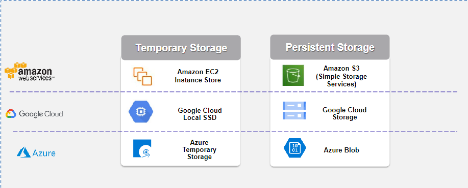
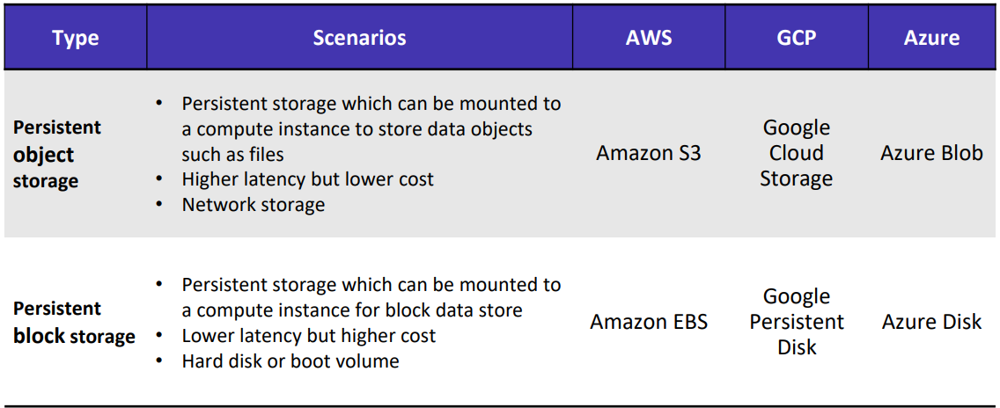
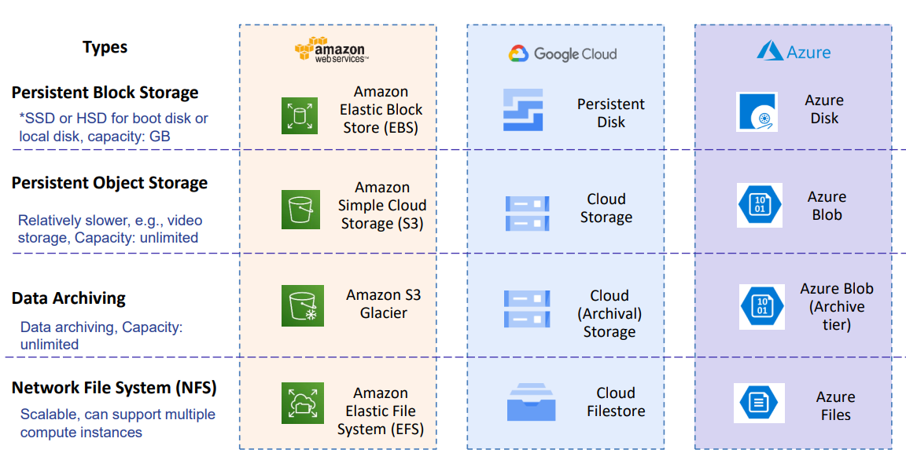
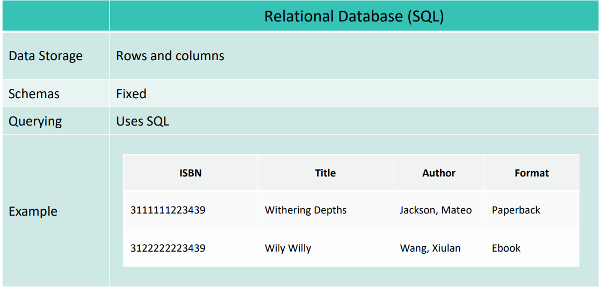
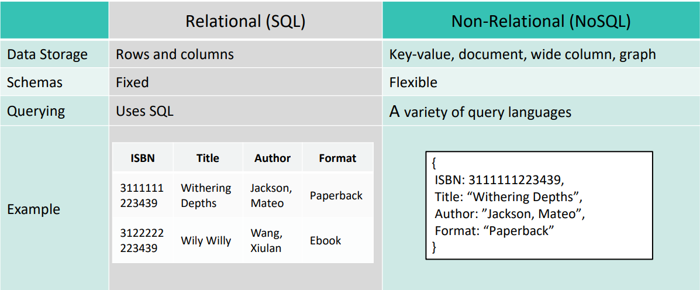
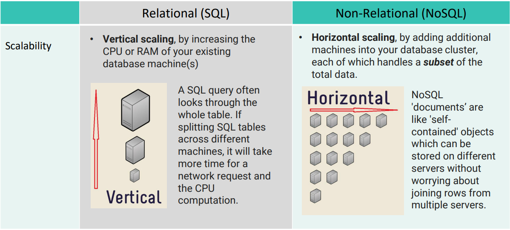
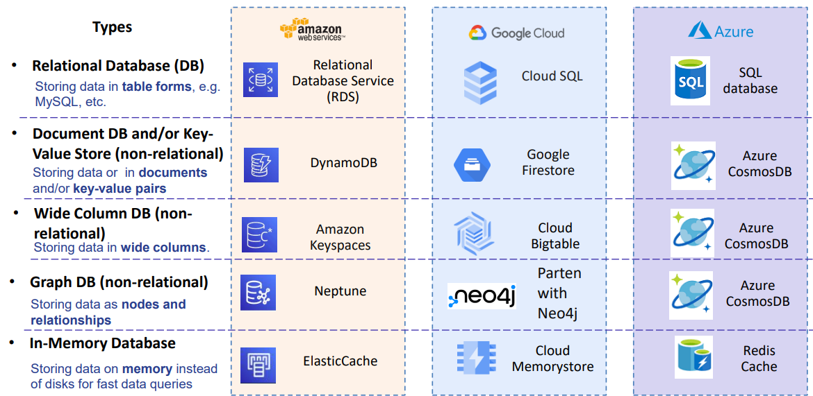

# Chapter 4 Cloud Data Analytics
# Cloud Storage
* Stores the data in the cloud and supports data operations for various applications such as data search, data analytics, IoT, etc
## Benefits of Cloud Storage
* Accessibility and redundancy
    * Data can be automatically replicated for data backup/recovery
* Elastic Volumes
    * Storage space can be expanded based on demand
* On-demand Pay-Per-Use
    * Can specify storage types, volume, storage duration
* Other service offering
    * Enables other features like data encryption, sync up methods, etc
## Temporary vs Persistant Storage
* ### Temporary Storage
    * Short term storage data stored will be **lost on redeployment**
        * E.g. AWS instance storage
* ### Persistant Storage
    * Data stored will be available through reboots, start/stop, or other lifecycle events
        * AWS EBS
## Examples

## Object Storage vs Block Storage
### How to update a file
* ### Object Storage
    * An entire object must be updated
* ### Block Storage
    * Individual blocks can be modified
## Object Storage
* ### A form of data storage in the cloud, where data is managed as distinct units, known as objects
* ### Treats each piece of data as an individual unit and requires updating the data as an entire object
## Storing Data as Objects
* Objects have 3 componenets
  * ID : Unique Identifier
  * Metadata : Description about the data such as timestamps, size, etc.
  * Data : Actual Data
* Data is stored in a flat structure. When a portion of the file is updated, the whole object needs to be updated
## Block Storage
* Block-level storage, stores data in small fixed-size blocks
* Can be place wherever it is more convenient and efficient
* Can be controlled and managed independently
# Storing data in Fixed-size Blocks
* A large file is divided into blocks which are smaller units of uniform size
* Each block is assigned a UID and stored in a system most convenient and efficient location.
* Sotrage volumes can be created using blocks, functioning like virutal hard drives to be attached/detached from VMs
## Types of service to store data

## Different types of services

## Key Takeaways
* ### Benefits of cloud data storage
  * ### High accessibility
  * ### Pay per use
  * ### Data encryption
  * ### Easy Sync Up
  * ### Sharing
* ### Cloud persistant storage can store and keep data even through reboots, start/stop, or other lifecycle events
* ### Cloud block storage can have relative lower access latency but higher cost. Cloud block storage can be used as hard disk/boot volumes
# Cloud Database
* Cloud database stores and backups the information in the cloud. Allows users to access, update and search them in the cloud. Cloud service providers provide on demand managed database services.
## Benefits of cloud database
* ### Usability and accessibility
  * Allows users to use online database services w/o need to manage the database server, OS updates, patches, etc. Can select different types of database engines and retrieve data as long as there is internet connections
* ### Scalability and redundancy
  * Provide features like auto scaling, snapshots for versioning and replica for redundancy and recovery
* ### On demand and pay per use
* ### Other service offering
  * Features such as encryption, migration service, user friendly interactive interfaces, version controls and easy connections with other data analytics services, etc
## Relational Database

### Amazaon Relational Database Service(RDS)
* A database instance is an isolated database environment that can contain multiple user-created databases. User can configure the database environments to allow users/applications to access the RDS instance via EC2 instance. There are 6 different relational database engines suported by Amazon RDS
## Relational versus non-relational databases

## Scalability of Relational vs Non-relational databases

## Different types of Clout Non-Relational Database Services

## Key Takeaway
* ### Cloud Database provide managed database solutions to store and backup the information and allow users to access, update and search them in the cloud
* ### To select suitable database services, users need to take various factors into consideration such as data types e.g., structured or non structured, data volume, response time, reliability, etc
* ### Cloud Relational Database store data in table form e.g row and column while Non-Relational Database services store data in various formats including documents, key-value pair, wide column stores and graphs
# Cloud AI and Data Analytics
## Data analytics
* Applies specific analytic techniques to process data and generate insights for business improvement/optimization.
## Cloud AI
* Refers to the delivery of artificial intelligence services through cloud
* Encompasses a variety of cloud resources and tools for developing AI models and provides AI services that allow users to implement AI capabilities into their applications without having to develop these technologies from scratch
# Key Takeaways
* ### Cloud data storages comes in 4 different types
  * Object Storage
  * Block Storage
  * Networked file systems
  * Data archiving storage
* ### Cloud database allows users to use cloud managed database solutions
  * SQL database
  * NoSQL database
  * Graph database
  * In-memory database
* ### Cloud AI tools and services use various technologies across AI lifecycle to support, develop, deploy,, monitor and sharing of AI solutions
* Cloud data analytic tools and services provide online tools for data operations such as data warehouse query data transformation, stream operations, scalable data processing, visualization and BI analytics