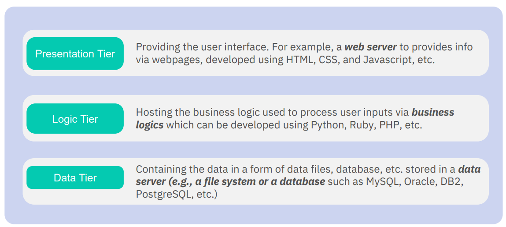
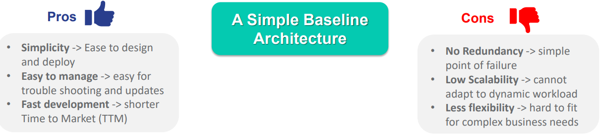
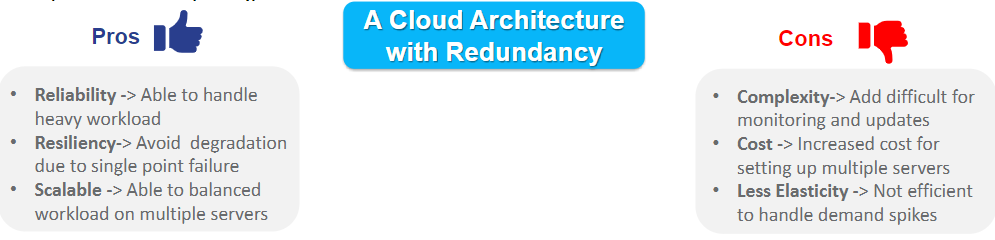
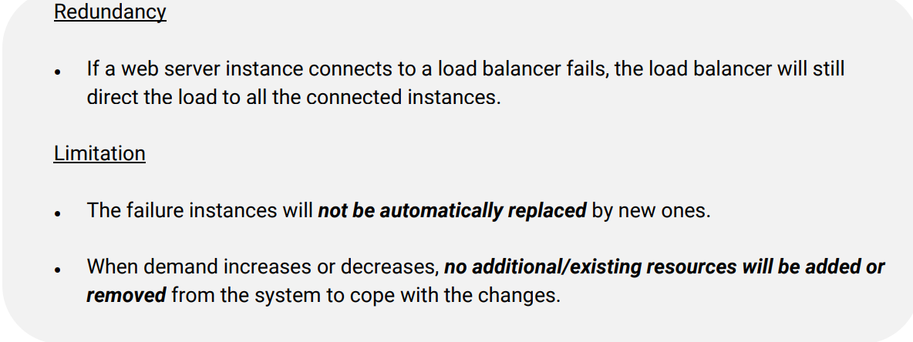
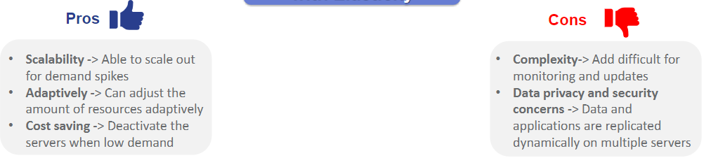
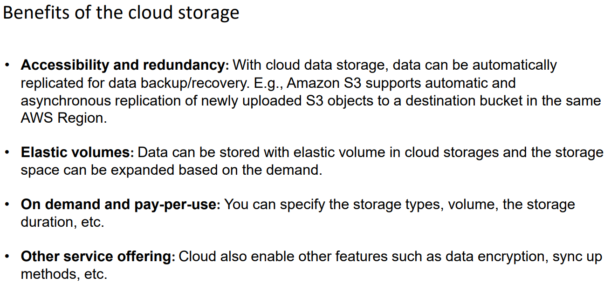
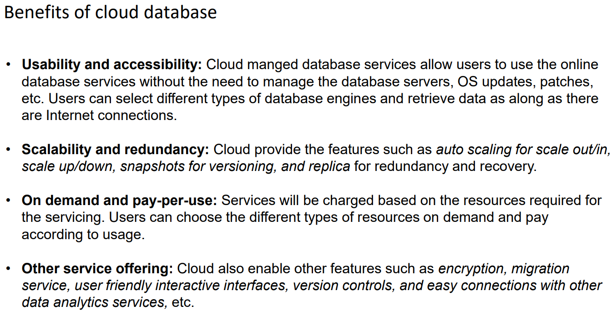

# Key things to note
# Chapter 1
* ### Cloud Computing enables computing services which provide IT-related capabilities such as computers, storage and apps with pay-per-use models
* ### Virtualization shares the physical IT resource with multiple users via different Cloud service models
* ### Hypervisor is a form of virutalization that allows one computer to host multiple guest VMs by sharing the resources such as memory and processing
* ### Container Runtime Engine is a form of OS virtualization that support multiple applications to run on the same OS
* ### New cloud computing technologies such as microservices, serverless computing, etc enable app modernization and deploy and run cloud services in dynamic cloud environments
# Chapter 2
## 3 Models IaaS PaaS SaaS
* ### IaaS

* ### PaaS

* ### SaaS

* ### Rough Look on all 3 models

## 2 New models CaaS FaaS

# Chapter 3
## 4 Cloud Deployment Models
* ### Public

* ### Private

* ### Hybrid

* ### Multi

## 3 Types of Cloud Architectures
* ### Simple Basic Architecture

* ### Cloud architecture with Load Balancer (Redundancy)

  * Redundancy is duplication/back-up of data to allow individual failures
* ### Cloud architecture with Elasticity

  * Elasticity is just auto scaler
# Chapter 4
* ## Cloud data storages comes in 4 different types

  * ### Object Storage
  * ### Block Storage
  * ### Networked file systems
  * ### Data archiving storage
* ## Cloud database allows users to use cloud managed database solutions

  * ## SQL database
    * ### Uses sql
    * ### store in row/col table
    * ### fixed schema
    * ### vertical scaling
  * ## NoSQL database
    * ### use a variety of query lang
    * ### stored in/with key-val/document/ wide col/graph
    * ### flexible schema
    * ### horizontal scaling
  * ### Graph database
  * ### In-memory database
* ### Cloud AI tools and services use various technologies across AI lifecycle to support, develop, deploy,, monitor and sharing of AI solutions
* ### Cloud data analytic tools and services provide online tools for data operations such as data warehouse query data transformation, stream operations, scalable data processing, visualization and BI analytics
# Chapter 5
* ## In Cloud shared respondsibility model both user and cloud service providers are respondsible for security and compliance. Specific Responsibilities vary on the service model
* ## Identity and Access Management(IAM) is a fine grant control specifying who or what resources can access. It also maanges identites across single or multiple AWS accounts and refine access perms using IAM policies
* ## VPCs and subnets isolate sections containing a pool of resources from the public cloud. Users can set rules in Firewall/Security Groups and specify the route tables to control network access
* ## Data encryption is a process converting plaintext data into ciphertext to protect data. One of the most effective ways to protect cloud data *in transit or at rest*