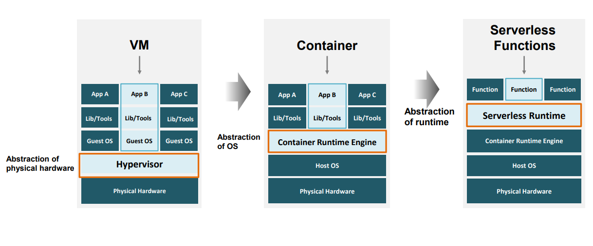

# Key things to note
# Chapter 1
* ### Cloud Computing enables computing services which provide IT-related capabilities such as computers, storage and apps with pay-per-use models
* ### Virtualization shares the physical IT resource with multiple users via different Cloud service models
* ### Hypervisor is a form of virutalization that allows one computer to host multiple guest VMs by sharing the resources such as memory and processing
* ### Container Runtime Engine is a form of OS virtualization that support multiple applications to run on the same OS
* ### New cloud computing technologies such as microservices, serverless computing, etc enable app modernization and deploy and run cloud services in dynamic cloud environments
# Chapter 2
## 3 Models IaaS PaaS SaaS
* ### IaaS

* ### PaaS

* ### SaaS

* ### Rough Look on all 3 models

## 2 New models CaaS FaaS

# Chapter 3
## 4 Cloud Deployment Models
* ### Public

* ### Private

* ### Hybrid

* ### Multi

## 3 Types of Cloud Architectures
